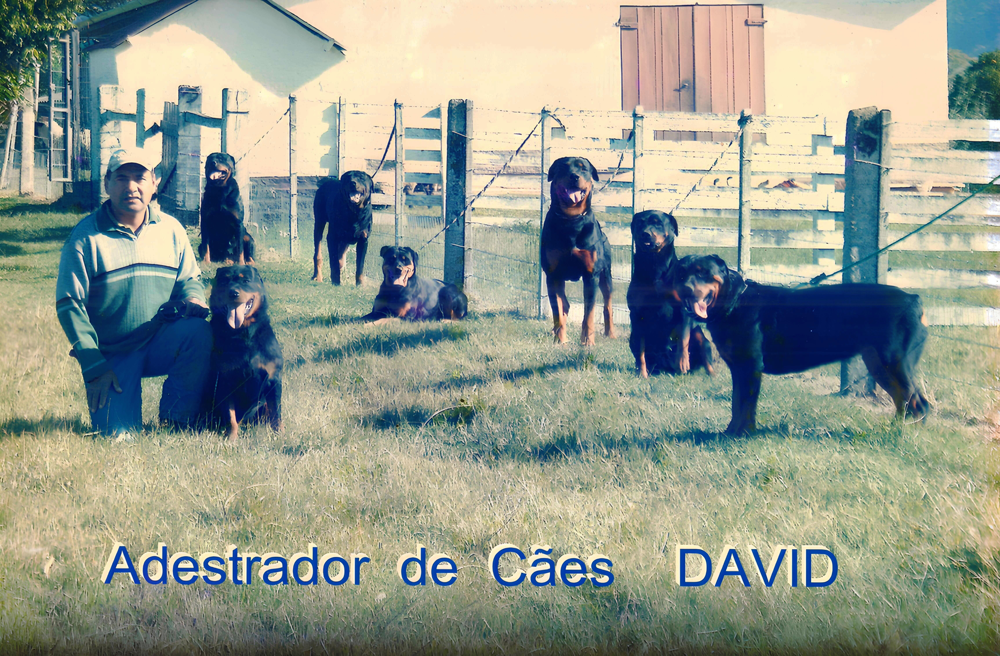

# David Adestrador de Cães



## Descrição

Este projeto é uma plataforma para o adestramento de cães, desenvolvido por **Simone Penido**. O template utilizado foi retirado do [Colorlib](https://colorlib.com/wp/templates/) e foi customizado para atender às necessidades deste projeto. As imagens foram geradas pelo site Leonardo AI através de prompts do ChatGPT.

## Funcionalidades

- **Cadastro de Usuários**: Permite aos donos de cães se cadastrarem na plataforma.
- **Cadastro de Cães**: Permite o cadastro de informações sobre os cães a serem adestrados.
- **Agendamento de Sessões**: Contato para agendar sessões de adestramento.
- **Blog**: Seção para publicações sobre adestramento e cuidados com cães.
- **Contato**: Formulário para contato direto com o adestrador.

## Tecnologias Utilizadas

- HTML5
- CSS3
- JavaScript
- Bootstrap
- Leonardo AI (para geração de imagens)
- Colorlib Template [https://colorlib.com/wp/templates/].
- Leonardo AI pela geração de imagens.
- ChatGPT pelos prompts criativos.

## Como Utilizar

1. Clone o repositório:

   ```bash
   git clone https://github.com/SimonePenido/David_Adestrador_De_Caes.git
